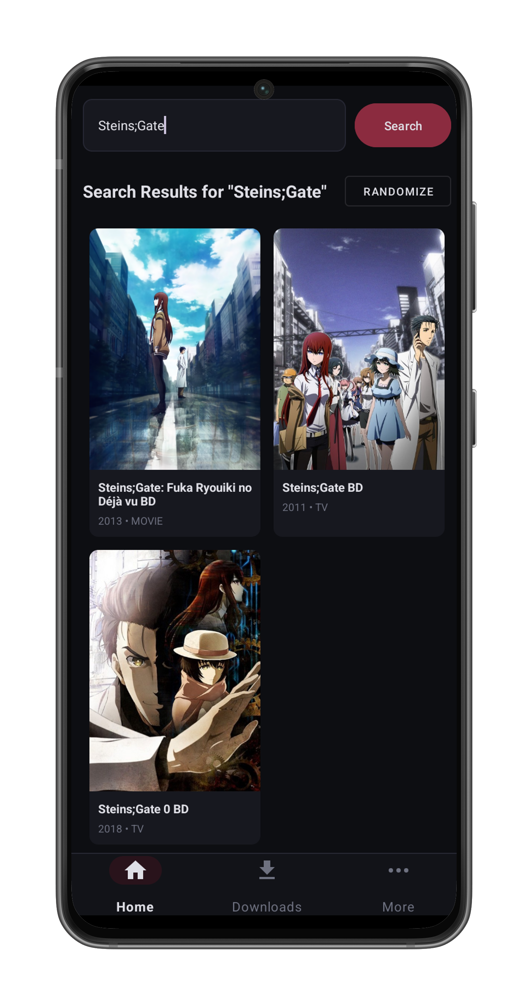
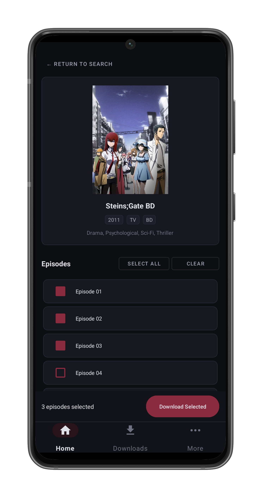
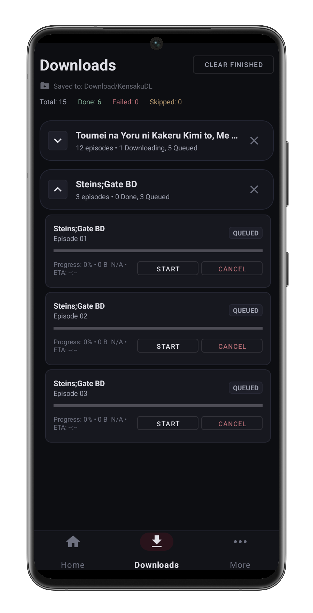
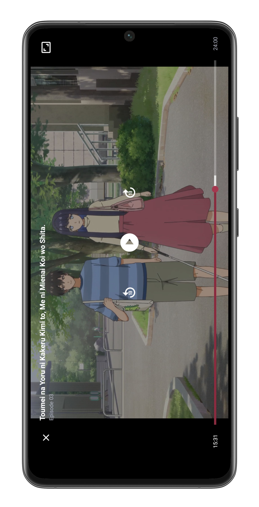

# KensakuDL

  <b>Search. Download. Watch offline.</b>

  

---

## About

KensakuDL is an Android anime batch downloader built for offline viewing.

Search for a series, select the episodes you want, download them, and watch them for later.

## Features

- **Anime Search** — Find series and browse their available episodes.
- **Batch Downloads** — Select multiple episodes and download them in one go.
- **Built-in Video Player** — Watch downloaded episodes directly inside KensakuDL.
- **Offline Playback** — Watch downloaded episodes without an internet connection.

## Why KensakuDL?

I wanted a simple Android app that could search for anime, queue multiple episodes, and download them for offline viewing.

I couldn't find one that did exactly what I wanted.

I eventually came across an Application downloader project from another GitHub user that showed me the workflow I was looking for was possible. The project eventually became unusable when the service it relied on went down.

So instead of looking for another one, I decided to make my own.

It started as a small CLI experiment in Termux, evolved into a web-based version,
and eventually became KensakuDL.

## Screenshots

<table>
  <tr>
    <td align="center"></td>
    <td align="center"></td>
  </tr>
  <tr>
    <td align="center"></td>
    <td align="center"></td>
  </tr>
</table>

## Requirements

- Android 7.0+
- ARM64 (`arm64-v8a`)

## Download

[**⬇️ Download KensakuDL**](https://github.com/hashierholmes/KensakuDL/releases/latest/download/KensakuDL.apk)

The button downloads the latest stable APK directly.